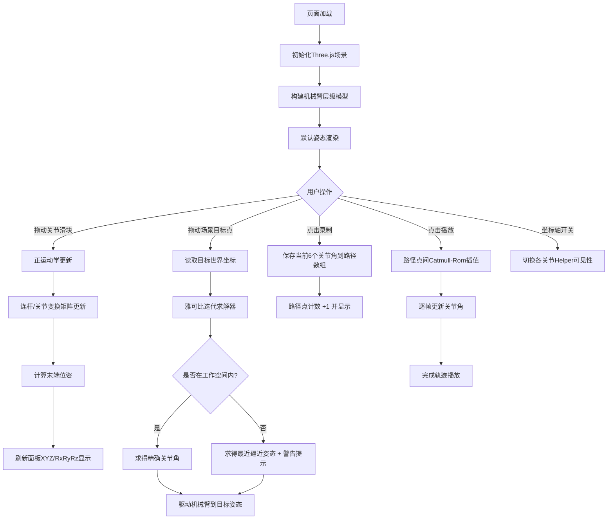

## 1. 产品概述
六自由度机械臂交互式可视化教学演示平台，面向客户演示和教学场景。用户可通过滑块手动控制各关节角度，拖动目标点触发逆运动学求解，并录制、播放关节轨迹路径。
- 核心价值：将抽象的正/逆运动学算法可视化，直观展示串联机械臂运动原理
- 目标用户：机器人工程师、高校学生、销售演示人员

## 2. 核心功能

### 2.1 用户角色
无角色区分，所有功能开放

### 2.2 功能模块
1. **3D场景主视图**：六轴机械臂模型、地面网格、可拖动目标点、OrbitControls视角控制
2. **右侧控制面板**：关节滑块、末端位姿显示、工作空间状态提示
3. **轨迹控制模块**：路径点录制、轨迹播放、平滑插值运动
4. **显示控制模块**：坐标轴显隐切换

### 2.3 页面详情
| 页面名称 | 模块名称 | 功能描述 |
|-----------|-------------|---------------------|
| 主页面 | 3D场景视图 | 六自由度串联机械臂（底座+6个旋转关节+6节连杆+末端夹爪），底座固定于网格地面，关节处显示转轴标识 |
| 主页面 | 正运动学控制 | 6个关节角度滑块（J1-J6），实时驱动对应关节绕轴旋转，末端执行器跟随运动 |
| 主页面 | 末端位姿显示 | 实时显示末端在世界坐标系的 X/Y/Z 位置（单位：mm）和姿态角（Rx/Ry/Rz） |
| 主页面 | 逆运动学求解 | 场景中可拖动的彩色目标球，实时计算雅可比迭代解，末端尽量贴合目标 |
| 主页面 | 工作空间检测 | 目标超出可达范围时显示「超出可达范围」警告，保持合理逼近姿态 |
| 主页面 | 轨迹录制播放 | 录制按钮保存当前关节姿态为路径点，播放按钮在多路径点间平滑插值运动 |
| 主页面 | 显示开关 | 切换各关节局部坐标轴（X红/Y绿/Z蓝）的显示/隐藏 |

## 3. 核心流程

用户进入页面 → 看到默认姿态的机械臂和控制面板
→ 操作1：拖动关节滑块 → 连杆实时转动 → 末端位姿数据更新
→ 操作2：拖动场景目标球 → 逆运动学实时求解 → 关节自动调整贴合目标 → 超范围时告警
→ 操作3：点击录制保存当前姿态 → 重复录制多个路径点 → 点击播放 → 机械臂沿路径平滑运动
→ 辅助操作：切换坐标轴显隐 / 用鼠标旋转缩放场景视角

## 4. 用户界面设计

### 4.1 设计风格
- **主色调**：深空蓝 (#0a1628) 背景 + 琥珀橙 (#ff8c42) 高亮 + 青绿 (#2dd4bf) 辅助色
- **副色调**：连杆金属灰 (#5a6a80)、关节橙红 (#f97316)、X轴红、Y轴绿、Z蓝（标准Gizmo色）
- **按钮风格**：圆角矩形 (radius: 8px)，按下凹陷反馈，2px 描边
- **字体**：标题用 Space Grotesk（等宽几何感），数据/UI用 JetBrains Mono（等宽数字对齐），辅助中文用思源黑体
- **布局风格**：左侧大区域3D场景，右侧 340px 固定控制面板，顶部细条状态栏
- **图标风格**：线条几何图标，emoji 用于状态提示（🔴🟢⚠️）

### 4.2 页面设计概览
| 页面名称 | 模块名称 | UI 元素 |
|-----------|-------------|-------------|
| 主页面 | 3D场景区 | 暗蓝渐变背景雾效，地面网格发光线，机械臂金属材质带环境光反射，目标点为半透明橙色球带拖尾 |
| 主页面 | 控制面板 | 深色毛玻璃卡片 (backdrop-filter: blur)，分组折叠区（关节控制/位姿显示/轨迹控制/显示设置） |
| 主页面 | 关节滑块组 | J1-J6 标签 + 滑块 + 数值框 + 单位(°)，滑块色条渐变对应关节编号 |
| 主页面 | 位姿读数区 | XYZ三行等宽数字，绿色正/红色负符号高亮，RxRyRz 三行姿态 |
| 主页面 | 轨迹控制 | 录制(●)/清除/播放(▶)/暂停按钮并排，路径点列表可删除单条 |
| 主页面 | 状态栏 | 顶部横条显示：当前模式（手动/IK）、目标状态提示、帧率信息 |

### 4.3 响应式
- 桌面端（默认）：1920px 以上，左场景+右面板固定布局
- 中等屏（1200-1920）：面板缩至 300px，保持可用
- 小屏（<1200）：面板折叠为底部抽屉式，点击展开
- 移动端不重点适配，保留基本功能

### 4.4 3D场景指导
- **环境**：深空蓝径向渐变天空盒 + 指数雾 (FogExp2, 密度 0.008)，远处渐变融入背景
- **光照**：三盏光 — 主光 (DirectionalLight, 强度 1.2, 暖白)、补光 (HemisphereLight, 天空/地)、关节点光 (PointLight, 关节处微光晕)
- **相机**：PerspectiveCamera (60° FOV)，初始位置 (600, 500, 800) 看向原点
- **视角控制**：OrbitControls，目标点固定在底座中心(0, 200, 0)，阻尼开启
- **组成与焦点**：机械臂居场景中心，底座在原点地面，目标点默认在工作空间右前方(400, 300, 200)
- **交互动画**：关节转动用线性过渡（0.05rad/帧），目标拖动有半透明预览球+连线，IK求解关节平滑过渡不跳变
- **后期处理**：轻微Bloom（发光阈值1.2，强度0.3）让高亮边缘柔和，Vignette暗角聚焦中心
