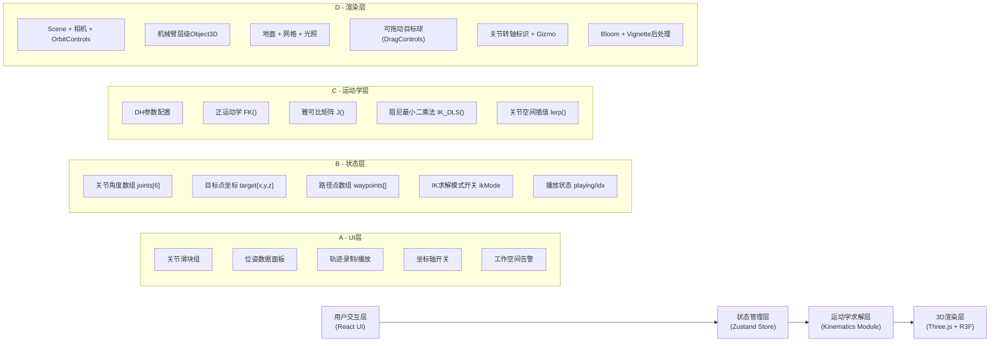

## 1. 架构设计



## 2. 技术说明

- **前端框架**：React@18 + TypeScript@5 + Vite@5
- **3D 渲染栈**：
  - `three@0.160` 核心渲染引擎
  - `@react-three/fiber@8.15` React 声明式 Three.js 封装
  - `@react-three/drei@9.92` 辅助组件（OrbitControls、GizmoHelper、Grid 等）
  - `@react-three/postprocessing@2.15` 后期处理（Bloom、Vignette）
- **状态管理**：`zustand@4.4` 轻量 store，管理关节角、目标点、路径等
- **样式方案**：`tailwindcss@3.4` + CSS Modules，自定义主题色变量
- **数学运算**：Three.js 内置 `Matrix4` / `Euler` / `Vector3` + 自行实现 6x6 雅可比矩阵运算
- **UI 组件**：纯 Tailwind + 原生 input[type=range] 自定义样式，避免重型组件库

## 3. 路由定义

| 路由 | 用途 |
|-------|---------|
| `/` | 主页面：3D场景 + 控制面板（单页应用无其他路由） |

## 4. 数据模型

### 4.1 DH 参数表（机械臂几何模型）
采用改进 DH 约定，长度单位 mm，角度单位 rad：

| 关节 i | θᵢ(初始) | αᵢ₋₁ | aᵢ₋₁ | dᵢ | 限位 min | 限位 max |
|-------|---------|------|------|-----|---------|---------|
| 1 (J1) | 0 | 0 | 0 | 330 | -π | π |
| 2 (J2) | -π/2 | -π/2 | 75 | 0 | -π | 0 |
| 3 (J3) | 0 | 0 | 350 | 0 | -π/2 | π/2 |
| 4 (J4) | 0 | -π/2 | 80 | 340 | -π | π |
| 5 (J5) | 0 | π/2 | 0 | 0 | -π | π |
| 6 (J6) | 0 | -π/2 | 0 | 140 | -π | π |

### 4.2 Zustand Store 状态类型

```typescript
type JointAngles = [number, number, number, number, number, number];

interface Waypoint {
  id: string;
  joints: JointAngles;
  timestamp: number;
}

interface RobotState {
  joints: JointAngles;
  targetJoints: JointAngles;     // IK或插值目标，用于平滑过渡
  ikMode: boolean;
  targetPos: { x: number; y: number; z: number };
  workspaceReachable: boolean;
  waypoints: Waypoint[];
  isPlaying: boolean;
  currentWaypointIdx: number;
  showAxes: boolean;
  
  // actions
  setJoint: (idx: number, value: number) => void;
  setJoints: (joints: JointAngles) => void;
  setTargetPos: (x: number, y: number, z: number) => void;
  addWaypoint: () => void;
  removeWaypoint: (id: string) => void;
  clearWaypoints: () => void;
  startPlayback: () => void;
  stopPlayback: () => void;
  toggleAxes: () => void;
  toggleIkMode: () => void;
}
```

## 5. 核心模块设计

### 5.1 正运动学模块 (FK)
- 输入：6个关节角
- 过程：逐关节累乘 DH 变换矩阵 `T_i = T(i-1) * Rz(θᵢ) * Tz(dᵢ) * Tx(aᵢ) * Rx(αᵢ)`
- 输出：末端 `{ position: Vector3, rotation: Euler, matrix: Matrix4 }`，以及各关节的全局矩阵数组（共7个：底座到J6末端）

### 5.2 逆运动学模块 (IK)
- 算法：阻尼最小二乘法 (Damped Least Squares)
- 单步迭代：`Δθ = Jᵀ(JJᵀ + λ²I)⁻¹ * Δx`，其中 λ=0.1 阻尼因子
- 迭代停止条件：误差 < 1mm 或 达到最大 30 次迭代
- 工作空间判定：最终残差 > 10mm 时标记 `workspaceReachable=false`
- 数值稳定：雅可比用中心差分法求解，关节角超限自动 clamp

### 5.3 轨迹播放模块
- 相邻路径点之间使用关节空间 Catmull-Rom 样条插值
- 每帧推进 2ms（约 60°/秒 关节速度上限）
- 播放完成后回到第一点循环（可选单次模式）

### 5.4 文件结构
```
src/
├── App.tsx                  # 根组件（左右布局）
├── main.tsx                 # 入口
├── index.css                # Tailwind + 全局样式
├── store/
│   └── useRobotStore.ts     # Zustand状态
├── kinematics/
│   ├── dhParams.ts          # DH参数常量
│   ├── forwardKinematics.ts # 正运动学
│   └── inverseKinematics.ts # IK求解器
├── components/
│   ├── Scene3D/
│   │   ├── index.tsx        # Canvas入口
│   │   ├── RobotArm.tsx     # 机械臂层级模型
│   │   ├── LinkSegment.tsx  # 单节连杆+关节
│   │   ├── Gripper.tsx      # 末端夹爪
│   │   ├── TargetMarker.tsx # 可拖动目标球
│   │   └── Ground.tsx       # 地面网格
│   ├── ControlPanel/
│   │   ├── index.tsx        # 右侧面板容器
│   │   ├── JointSliders.tsx # 6个关节滑块
│   │   ├── PoseDisplay.tsx  # XYZ/RxRyRz显示
│   │   ├── WaypointPanel.tsx# 录制/播放/列表
│   │   └── DisplayToggles.tsx # 开关组
│   └── StatusBar.tsx        # 顶部状态栏
└── utils/
    ├── math.ts              # 矩阵/向量辅助
    └── clamp.ts             # 限位函数
```
